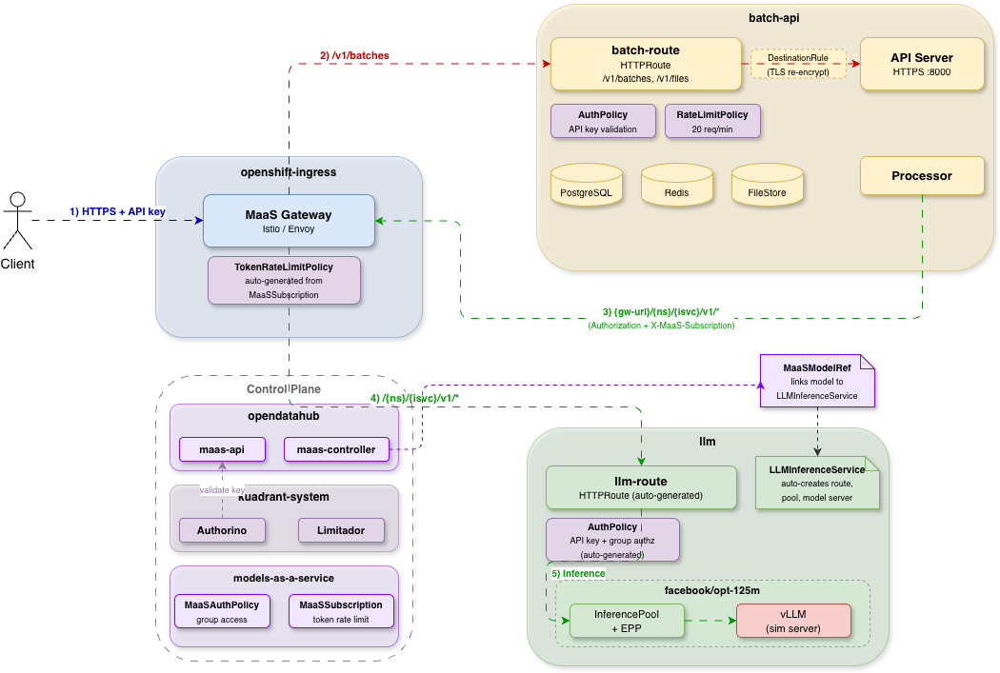

# Batch Gateway on MaaS (Models-as-a-Service)

This guide demonstrates how to deploy batch-gateway on OpenShift integrated with the [MaaS](https://github.com/opendatahub-io/models-as-a-service) platform. MaaS provides the Gateway, Istio, Kuadrant, cert-manager, AuthPolicy, and TokenRateLimitPolicy. This guide only deploys: MaaS platform + sample model + batch-gateway + HTTPRoute.

## 1. Architecture

### 1.1 Namespace Layout

| Namespace | Purpose |
|-----------|---------|
| `openshift-ingress` | Gateway data plane (Istio/Envoy proxy), managed by MaaS |
| `opendatahub` | MaaS platform (maas-api, maas-controller, ODH operator) |
| `models-as-a-service` | MaaS policy namespace (MaaSAuthPolicy, MaaSSubscription CRs) |
| `kuadrant-system` | Kuadrant operator, Authorino, Limitador (managed by MaaS) |
| `cert-manager` / `cert-manager-operator` | cert-manager (managed by MaaS) |
| `batch-api` | batch-gateway (apiserver + processor), Redis, PostgreSQL |
| `llm` | LLMInferenceService, model servers, InferencePool, EPP |

### 1.2 Data Flow



**Batch inference flow**:
1. Client sends a batch request (e.g. `POST /v1/batches`) to the OpenShift Gateway (`maas-default-gateway`) with a **MaaS API key** (`Authorization: Bearer <api-key>`)
2. Gateway matches `/v1/batches`, `/v1/files` → **batch-route** (HTTPRoute)
    - **AuthPolicy** on the batch-route validates the API key via MaaS API HTTP callback (`maas-api /internal/v1/api-keys/validate`) — invalid keys are rejected with 401
    - **RateLimitPolicy** on the batch-route enforces per-user request rate limiting (e.g. 20 req/min), keyed by MaaS user identity from API key validation — excess requests are rejected with 429
    - Authenticated request is forwarded to **batch-gateway apiserver**, which stores the batch job
3. **Processor** dequeues the batch job and sends inference requests back through the same OpenShift Gateway (`maas-default-gateway`) with the user's original API key
4. The Gateway matches `/{ns}/{isvc}/v1/*` → **llm-route** (HTTPRoute, auto-generated by MaaSModelRef + LLMInferenceService)
    - **AuthPolicy** on the llm-route (auto-generated by maas-controller) validates the API key and checks group-based authorization via MaaSAuthPolicy — if the user is not in an authorized group, the request is rejected with 403
    - **TokenRateLimitPolicy** (auto-generated from MaaSSubscription) enforces per-subscription token rate limiting, keyed by MaaS subscription
5. Request is routed to **InferencePool** → **EPP** (endpoint picker) → **vLLM** model server, and the response is returned to the Processor, which adds the response to the batch job's output file

### 1.3 Authentication

MaaS uses **API key** authentication instead of Kubernetes tokens. Clients obtain an API key from the MaaS API using their OpenShift token, then use it in the `Authorization: Bearer <api-key>` header. Authorino validates the API key via an HTTP callback to `maas-api /internal/v1/api-keys/validate`.

```bash
# Login as OpenShift user and create a MaaS API key
oc login <server> -u <username> -p <password>
USER_TOKEN=$(oc whoami -t)

curl -sk -H "Authorization: Bearer ${USER_TOKEN}" \
    -H "Content-Type: application/json" \
    -X POST -d '{"name":"my-key","expiresIn":"1h"}' \
    https://maas.<cluster-domain>/maas-api/v1/api-keys | jq -r '.key'
```

HTTPRoute authentication behavior:
- **LLM route**: Requires a valid MaaS API key — invalid or missing keys are rejected with **401**
- **Batch route**: Requires a valid MaaS API key — invalid or missing keys are rejected with **401**

### 1.4 Authorization Model

Users must belong to a group specified in `MaaSAuthPolicy.spec.subjects.groups` to access the model. To grant a group access, create a MaaSAuthPolicy and add users to the group:

> **Note**: Unlike the k8s deployment (SubjectAccessReview on `inferencepools`) or RHOAI (SubjectAccessReview on `llminferenceservices`), MaaS uses group-based authorization via MaaSAuthPolicy CRs managed by the maas-controller.

```bash
# Create MaaSAuthPolicy to grant group access to a model
oc apply -f - <<EOF
apiVersion: maas.opendatahub.io/v1alpha1
kind: MaaSAuthPolicy
metadata:
  name: <policy-name>
  namespace: models-as-a-service
spec:
  modelRefs:
    - name: <isvc-name>
      namespace: <llm-namespace>
  subjects:
    groups:
      - name: <group-name>
EOF

# Add a user to the authorized group
oc adm groups add-users <group-name> <username>
```

**MaaSSubscription** defines per-group token rate limits, auto-generating TokenRateLimitPolicy from the subscription CR.

HTTPRoute authorization behavior:
- **LLM route**: Group-based authorization via MaaSAuthPolicy (maas-controller auto-generates Kuadrant AuthPolicy) — users not in an authorized group are rejected with **403**
- **Batch route**: No authorization check — authorization is enforced by the LLM route when the processor forwards inference requests with the user's original API key

### 1.5 Security boundary: batch-route vs llm-route

For security and operations readers: **admission on the batch API is not the same as authorization for inference.**

- **batch-route** validates the MaaS API key (same HTTP callback as other MaaS routes) and applies batch-side **RateLimitPolicy**. Invalid or missing keys are rejected with **401**; excess batch API traffic is rejected with **429**. It does **not** prove the caller is in a group allowed to use a given model (**MaaSAuthPolicy**).
- **llm-route** validates the key **and** enforces group-based model access (auto-generated policies from MaaS). A user can create a batch job and still see **per-request failures** (often surfaced as failed lines or job errors) when the llm-route returns **403** — this is **by design**, not a bypass of model access control.

Configure **`passThroughHeaders: {Authorization, X-MaaS-Subscription}`** (or the subset your deployment needs) so the processor forwards the end user’s credentials on inference calls. Without that, the gateway cannot apply the same model-route checks to batch-driven inference that direct clients receive.

## 2. Prerequisites

- OpenShift cluster (self-managed, not ROSA/HyperShift)
- CLI tools: `oc`, `kubectl`, `helm`, `kustomize`, `jq`, `htpasswd`
- Cluster admin access

## 3. Installation Steps

### 3.1 Install MaaS Platform

MaaS installs the full stack: ODH operator, Gateway, Istio, Kuadrant, cert-manager, LeaderWorkerSet, and RHOAI components.

<details>
<summary>Clone and deploy MaaS</summary>

```bash
MAAS_REF=main
MAAS_DIR=/tmp/maas

git clone --depth 1 --branch "${MAAS_REF}" \
    https://github.com/opendatahub-io/models-as-a-service.git "${MAAS_DIR}"

# Run MaaS deploy script (installs all prerequisites + platform)
(cd "${MAAS_DIR}" && MAAS_REF="${MAAS_REF}" ./scripts/deploy.sh)
```

</details>

<details>
<summary>Patch maas-api RBAC for MaaS CRDs</summary>

In operator mode, ODH creates the maas-api ServiceAccount but not all required ClusterRole permissions. This patch adds permissions for MaaSSubscription and MaaSModelRef CRDs.

```bash
MAAS_NAMESPACE=opendatahub

oc apply -f - <<EOF
apiVersion: rbac.authorization.k8s.io/v1
kind: ClusterRole
metadata:
  name: maas-api-extra
rules:
- apiGroups: ["maas.opendatahub.io"]
  resources: ["maassubscriptions", "maasmodelrefs"]
  verbs: ["get", "list", "watch"]
- apiGroups: [""]
  resources: ["secrets"]
  resourceNames: ["maas-db-config"]
  verbs: ["get"]
- apiGroups: ["authorization.k8s.io"]
  resources: ["subjectaccessreviews"]
  verbs: ["create"]
- apiGroups: ["gateway.networking.k8s.io"]
  resources: ["httproutes"]
  verbs: ["get", "list", "watch"]
---
apiVersion: rbac.authorization.k8s.io/v1
kind: ClusterRoleBinding
metadata:
  name: maas-api-extra
subjects:
- kind: ServiceAccount
  name: maas-api
  namespace: ${MAAS_NAMESPACE}
roleRef:
  kind: ClusterRole
  name: maas-api-extra
  apiGroup: rbac.authorization.k8s.io
EOF

oc rollout restart deploy/maas-api -n ${MAAS_NAMESPACE}
oc rollout status deploy/maas-api -n ${MAAS_NAMESPACE} --timeout=120s
```

</details>

<details>
<summary>Create a self-signed ClusterIssuer</summary>

```bash
oc apply -f - <<'EOF'
apiVersion: cert-manager.io/v1
kind: ClusterIssuer
metadata:
  name: selfsigned-issuer
spec:
  selfSigned: {}
EOF
```

</details>

### 3.2 Deploy Sample Model

The MaaS repo includes a simulator sample that deploys a simulated `facebook/opt-125m` model using `LLMInferenceService`.

<details>
<summary>Deploy the simulator sample via kustomize</summary>

```bash
LLM_NS=llm
oc create namespace "${LLM_NS}" 2>/dev/null || true

kustomize build "${MAAS_DIR}/docs/samples/models/simulator" | oc apply -f -

# Wait for model server deployment
oc rollout status deploy/facebook-opt-125m-simulated-kserve -n ${LLM_NS} --timeout=300s

# Wait for LLMInferenceService to be ready
oc wait llminferenceservice/facebook-opt-125m-simulated -n ${LLM_NS} \
    --for=condition=Ready --timeout=300s
```

> **Note**: The kustomize namePrefix produces `facebook-opt-125m-simulated` as the LLMInferenceService name.

</details>

<details>
<summary>Check model installation</summary>

```
oc get all -n llm

NAME                                                                  READY   STATUS    RESTARTS   AGE
pod/facebook-opt-125m-simulated-kserve-7889cd8c78-h7kkx               1/1     Running   0          17m
pod/facebook-opt-125m-simulated-kserve-router-scheduler-7cbf65gkxdd   1/1     Running   0          17m

NAME                                                             TYPE        CLUSTER-IP       EXTERNAL-IP   PORT(S)                               AGE
service/facebook-opt-125m-simulated-epp-service                  ClusterIP   172.30.98.219    <none>        9002/TCP,9003/TCP,9090/TCP,5557/TCP   17m
service/facebook-opt-125m-simulated-inference-pool-ip-d9edcaa3   ClusterIP   None             <none>        54321/TCP                             17m
service/facebook-opt-125m-simulated-kserve-workload-svc          ClusterIP   172.30.123.214   <none>        8000/TCP                              17m

NAME                                                                  READY   UP-TO-DATE   AVAILABLE   AGE
deployment.apps/facebook-opt-125m-simulated-kserve                    1/1     1            1           17m
deployment.apps/facebook-opt-125m-simulated-kserve-router-scheduler   1/1     1            1           17m

NAME                                                                             DESIRED   CURRENT   READY   AGE
replicaset.apps/facebook-opt-125m-simulated-kserve-7889cd8c78                    1         1         1       17m
replicaset.apps/facebook-opt-125m-simulated-kserve-router-scheduler-7cbf655775   1         1         1       17m
```
</details>

### 3.3 Configure MaaS Model Policies

MaaS uses three CRDs to manage model access and rate limits. The maas-controller watches these CRs and auto-generates Kuadrant AuthPolicy and TokenRateLimitPolicy.

<details>
<summary>Create MaaSModelRef, MaaSAuthPolicy, and MaaSSubscription</summary>

```bash
MAAS_POLICY_NAMESPACE=models-as-a-service
MAAS_TEST_GROUP=tier-free-users   # The group will be created in Section 4.1; MaaSAuthPolicy only declares the reference

oc create namespace "${MAAS_POLICY_NAMESPACE}" 2>/dev/null || true

# MaaSModelRef — links model name to LLMInferenceService
oc apply -f - <<EOF
apiVersion: maas.opendatahub.io/v1alpha1
kind: MaaSModelRef
metadata:
  name: facebook-opt-125m-simulated
  namespace: ${LLM_NS}
spec:
  modelRef:
    kind: LLMInferenceService
    name: facebook-opt-125m-simulated
EOF

# MaaSAuthPolicy — grant group access to model
oc apply -f - <<EOF
apiVersion: maas.opendatahub.io/v1alpha1
kind: MaaSAuthPolicy
metadata:
  name: batch-model-access
  namespace: ${MAAS_POLICY_NAMESPACE}
spec:
  modelRefs:
    - name: facebook-opt-125m-simulated
      namespace: ${LLM_NS}
  subjects:
    groups:
      - name: ${MAAS_TEST_GROUP}
EOF

# MaaSSubscription — per-group token rate limit (authorized group)
oc apply -f - <<EOF
apiVersion: maas.opendatahub.io/v1alpha1
kind: MaaSSubscription
metadata:
  name: batch-test-subscription
  namespace: ${MAAS_POLICY_NAMESPACE}
spec:
  owner:
    groups:
      - name: ${MAAS_TEST_GROUP}
  modelRefs:
    - name: facebook-opt-125m-simulated
      namespace: ${LLM_NS}
      tokenRateLimits:
        - limit: 500
          window: 1m
EOF

# MaaSSubscription — unauthorized group (has subscription but no model access)
oc apply -f - <<EOF
apiVersion: maas.opendatahub.io/v1alpha1
kind: MaaSSubscription
metadata:
  name: batch-test-subscription-unauth
  namespace: ${MAAS_POLICY_NAMESPACE}
spec:
  owner:
    groups:
      - name: tier-unauth-users
  modelRefs:
    - name: facebook-opt-125m-simulated
      namespace: ${LLM_NS}
      tokenRateLimits:
        - limit: 500
          window: 1m
EOF
```

> - **MaaSModelRef**: Registers the model with the MaaS platform. The maas-controller reconciles this CR to generate the LLM route's HTTPRoute and AuthPolicy.
> - **MaaSAuthPolicy**: Defines which groups can access the model. Only users in the specified groups will pass the LLM route's authorization check.
> - **MaaSSubscription**: Defines per-group token rate limits. The maas-controller auto-generates a TokenRateLimitPolicy from this CR.

</details>

<details>
<summary>Wait for policies to be enforced</summary>

```bash
# Wait for MaaSModelRef to be Ready
oc wait maasmodelref/facebook-opt-125m-simulated -n ${LLM_NS} \
    --for=jsonpath='{.status.phase}'=Ready --timeout=300s

# Wait for AuthPolicies to be enforced
oc get authpolicy -A -o wide

# Wait for TokenRateLimitPolicy to be generated
oc get tokenratelimitpolicy -n ${LLM_NS}
```

</details>

### 3.4 Install Batch Gateway

<details>
<summary>Create namespace and install dependencies</summary>

```bash
BATCH_NS=batch-api
oc create namespace "${BATCH_NS}" 2>/dev/null || true

# Install Redis
helm install redis oci://registry-1.docker.io/bitnamicharts/redis \
    --namespace ${BATCH_NS} --create-namespace \
    --set architecture=standalone \
    --set auth.enabled=false
oc rollout status statefulset/redis-master -n ${BATCH_NS} --timeout=120s

# Install PostgreSQL
helm install postgresql oci://registry-1.docker.io/bitnamicharts/postgresql \
    --namespace ${BATCH_NS} --create-namespace \
    --set auth.postgresPassword=postgres \
    --set auth.database=batch
oc rollout status statefulset/postgresql -n ${BATCH_NS} --timeout=120s

# Create application secret
# Replace <your-password> with your actual PostgreSQL password
kubectl create secret generic batch-gateway-secrets \
    --namespace ${BATCH_NS} \
    --from-literal=redis-url="redis://redis-master.${BATCH_NS}.svc.cluster.local:6379/0" \
    --from-literal=postgresql-url="postgresql://postgres:<your-password>@postgresql.${BATCH_NS}.svc.cluster.local:5432/batch?sslmode=disable"

# Create PVC for batch file storage (alternatively, S3-compatible storage can be used — see Helm chart values for s3 configuration)
oc apply -f - <<EOF
apiVersion: v1
kind: PersistentVolumeClaim
metadata:
  name: batch-gateway-files
  namespace: ${BATCH_NS}
spec:
  accessModes: [ReadWriteMany]
  resources:
    requests:
      storage: 1Gi
EOF
```

> **Note**: Redis auth and PostgreSQL persistence are disabled for demo purposes. For production, enable Redis authentication and configure persistent storage.

</details>

<details>
<summary>Install batch-gateway</summary>

```bash
IMAGE_TAG=v0.1.0
APISERVER_REPO=quay.io/redhat-user-workloads/open-data-hub-tenant/temp-batch-gateway-apiserver
PROCESSOR_REPO=quay.io/redhat-user-workloads/open-data-hub-tenant/temp-batch-gateway-processor
GC_REPO=quay.io/redhat-user-workloads/open-data-hub-tenant/temp-batch-gateway-gc
```

```bash
MAAS_MODEL_NAME="facebook/opt-125m"
DOMAIN=$(oc get ingresses.config/cluster -o jsonpath='{.spec.domain}')
MODEL_GW_URL="https://maas.${DOMAIN}/${LLM_NS}/facebook-opt-125m-simulated"

helm install batch-gateway ./charts/batch-gateway \
    --namespace ${BATCH_NS} \
    --set "apiserver.image.repository=${APISERVER_REPO}" \
    --set "apiserver.image.tag=${IMAGE_TAG}" \
    --set "processor.image.repository=${PROCESSOR_REPO}" \
    --set "processor.image.tag=${IMAGE_TAG}" \
    --set "gc.image.repository=${GC_REPO}" \
    --set "gc.image.tag=${IMAGE_TAG}" \
    --set "global.secretName=batch-gateway-secrets" \
    --set "global.dbClient.type=postgresql" \
    --set "global.fileClient.type=fs" \
    --set "global.fileClient.fs.basePath=/tmp/batch-gateway" \
    --set "global.fileClient.fs.pvcName=batch-gateway-files" \
    --set "processor.config.modelGateways.${MAAS_MODEL_NAME}.url=${MODEL_GW_URL}" \
    --set "processor.config.modelGateways.${MAAS_MODEL_NAME}.requestTimeout=5m" \
    --set "processor.config.modelGateways.${MAAS_MODEL_NAME}.maxRetries=3" \
    --set "processor.config.modelGateways.${MAAS_MODEL_NAME}.initialBackoff=1s" \
    --set "processor.config.modelGateways.${MAAS_MODEL_NAME}.maxBackoff=60s" \
    --set "processor.config.modelGateways.${MAAS_MODEL_NAME}.tlsInsecureSkipVerify=true" \
    --set "apiserver.config.batchAPI.passThroughHeaders={Authorization,X-MaaS-Subscription}" \
    --set apiserver.tls.enabled=true \
    --set apiserver.tls.certManager.enabled=true \
    --set apiserver.tls.certManager.issuerName=selfsigned-issuer \
    --set apiserver.tls.certManager.issuerKind=ClusterIssuer \
    --set "apiserver.tls.certManager.dnsNames={batch-gateway-apiserver,batch-gateway-apiserver.${BATCH_NS}.svc.cluster.local,localhost}"
```

> - **`modelGateways.<model>.url`**: The processor uses the MaaS Gateway's **external hostname** (`https://maas.<domain>/...`) because the Gateway listener requires SNI matching. Internal Service FQDN causes TLS handshake failure.
> - **`passThroughHeaders: {Authorization, X-MaaS-Subscription}`**: Ensures the processor sends inference requests on behalf of the original user, so the LLM route's AuthPolicy can enforce model-level authorization and the correct subscription is used for token rate limiting.
> - **File storage**: This example uses `global.fileClient.type=fs` with a PVC. To use S3-compatible storage instead, replace the `fs` options with:
>   ```
>   --set "global.fileClient.type=s3"
>   --set "global.fileClient.s3.endpoint=http://<s3-endpoint>:9000"
>   --set "global.fileClient.s3.region=us-east-1"
>   --set "global.fileClient.s3.accessKeyId=<access-key>"
>   --set "global.fileClient.s3.prefix=<bucket-name>"
>   --set "global.fileClient.s3.usePathStyle=true"
>   --set "global.fileClient.s3.autoCreateBucket=true"
>   ```
>   and add `--from-literal=s3-secret-access-key=<secret-key>` to the application secret.

</details>

### 3.5 Configure HTTPRoute and Policies for Batch Gateway

<details>
<summary>Create HTTPRoute and DestinationRule for Batch API Server</summary>

```bash
GATEWAY_NAME=maas-default-gateway
GATEWAY_NAMESPACE=openshift-ingress

# Batch HTTPRoute
oc apply -f - <<EOF
apiVersion: gateway.networking.k8s.io/v1
kind: HTTPRoute
metadata:
  name: batch-route
  namespace: ${BATCH_NS}
spec:
  parentRefs:
  - name: ${GATEWAY_NAME}
    namespace: ${GATEWAY_NAMESPACE}
  rules:
  - matches:
    - path:
        type: PathPrefix
        value: /v1/batches
    - path:
        type: PathPrefix
        value: /v1/files
    backendRefs:
    - name: batch-gateway-apiserver
      port: 8000
EOF

# DestinationRule for TLS re-encrypt between Gateway and batch apiserver
oc apply -f - <<EOF
apiVersion: networking.istio.io/v1
kind: DestinationRule
metadata:
  name: batch-gateway-backend-tls
  namespace: ${GATEWAY_NAMESPACE}
spec:
  host: batch-gateway-apiserver.${BATCH_NS}.svc.cluster.local
  trafficPolicy:
    portLevelSettings:
    - port:
        number: 8000
      tls:
        mode: SIMPLE
        insecureSkipVerify: true
EOF
```

</details>

<details>
<summary>Create AuthPolicy for Batch API Server (MaaS API key validation)</summary>

The batch AuthPolicy uses the same MaaS API key validation mechanism as model AuthPolicies. Authorino calls `maas-api` to validate the API key and extract user identity.

```bash
MAAS_NAMESPACE=opendatahub

oc apply -f - <<EOF
apiVersion: kuadrant.io/v1
kind: AuthPolicy
metadata:
  name: batch-auth
  namespace: ${BATCH_NS}
spec:
  targetRef:
    group: gateway.networking.k8s.io
    kind: HTTPRoute
    name: batch-route
  rules:
    metadata:
      apiKeyValidation:
        http:
          url: "https://maas-api.${MAAS_NAMESPACE}.svc.cluster.local:8443/internal/v1/api-keys/validate"
          contentType: application/json
          method: POST
          body:
            expression: '{"key": request.headers.authorization.replace("Bearer ", "")}'
        metrics: false
        priority: 0
    authentication:
      api-keys:
        plain:
          selector: request.headers.authorization
        metrics: false
        priority: 0
    authorization:
      api-key-valid:
        patternMatching:
          patterns:
          - selector: auth.metadata.apiKeyValidation.valid
            operator: eq
            value: "true"
        metrics: false
        priority: 0
    response:
      success:
        filters:
          identity:
            json:
              properties:
                userid:
                  selector: auth.metadata.apiKeyValidation.username
                keyId:
                  selector: auth.metadata.apiKeyValidation.keyId
            metrics: false
            priority: 0
        headers:
          X-MaaS-Username:
            plain:
              selector: auth.metadata.apiKeyValidation.username
            metrics: false
            priority: 0
          X-MaaS-Key-Id:
            plain:
              selector: auth.metadata.apiKeyValidation.keyId
            metrics: false
            priority: 0
      unauthenticated:
        code: 401
        message:
          value: "Authentication required"
      unauthorized:
        code: 403
        message:
          value: "Access denied"
EOF
```

> **Note**: Unlike the k8s/RHOAI deployments (kubernetesTokenReview), MaaS uses an HTTP callback to validate API keys. The `metadata.apiKeyValidation` layer calls `maas-api` first, then the `authorization` layer checks if the key is valid.

</details>

<details>
<summary>Create RateLimitPolicy for Batch API Server</summary>

```bash
# Batch RateLimitPolicy (20 requests/min per user)
oc apply -f - <<EOF
apiVersion: kuadrant.io/v1
kind: RateLimitPolicy
metadata:
  name: batch-ratelimit
  namespace: ${BATCH_NS}
spec:
  targetRef:
    group: gateway.networking.k8s.io
    kind: HTTPRoute
    name: batch-route
  limits:
    per-user:
      rates:
      - limit: 20
        window: 1m
      counters:
      - expression: auth.identity.userid
EOF
```

> **Note**: The counter uses `auth.identity.userid` (extracted from the MaaS API key validation response), not `auth.identity.user.username` (which is used in kubernetesTokenReview-based deployments).

</details>

## 4. Test

### 4.1 Create MaaS Test Users

MaaS uses OpenShift OAuth for user management. An HTPasswd identity provider is configured with two test users: an authorized user (in the access group) and an unauthorized user (not in the group).

<details>
<summary>Create HTPasswd users and OpenShift group</summary>

```bash
MAAS_TEST_USER=testuser
MAAS_TEST_PASS=testpass
MAAS_TEST_GROUP=tier-free-users
MAAS_UNAUTH_USER=testuser-unauth
MAAS_UNAUTH_PASS=testpass

# Create htpasswd file with both users
htpasswd -cbB /tmp/htpasswd "${MAAS_TEST_USER}" "${MAAS_TEST_PASS}"
htpasswd -bB  /tmp/htpasswd "${MAAS_UNAUTH_USER}" "${MAAS_UNAUTH_PASS}"

# Create secret and configure OAuth
oc create secret generic htpass-secret \
    --from-file=htpasswd=/tmp/htpasswd \
    -n openshift-config \
    --dry-run=client -o yaml | oc apply -f -

oc patch oauth cluster --type=merge -p '
spec:
  identityProviders:
  - name: htpasswd
    type: HTPasswd
    htpasswd:
      fileData:
        name: htpass-secret'

# Wait for OAuth restart
sleep 30

# Create authorized group and add authorized user
oc adm groups new "${MAAS_TEST_GROUP}" 2>/dev/null || true
oc adm groups add-users "${MAAS_TEST_GROUP}" "${MAAS_TEST_USER}"

# Create unauthorized group (has subscription but NO model access via MaaSAuthPolicy)
MAAS_UNAUTH_GROUP=tier-unauth-users
oc adm groups new "${MAAS_UNAUTH_GROUP}" 2>/dev/null || true
oc adm groups add-users "${MAAS_UNAUTH_GROUP}" "${MAAS_UNAUTH_USER}"
```

> **Note**: The unauthorized user is in `tier-unauth-users` (not `tier-free-users`). This group has a MaaSSubscription (so the user can create API keys) but no MaaSAuthPolicy (so the user is denied model access).

</details>

### 4.2 Obtain MaaS API Keys

```bash
DOMAIN=$(oc get ingresses.config/cluster -o jsonpath='{.spec.domain}')
GW_URL="https://maas.${DOMAIN}"
LLM_NS=llm
MAAS_MODEL_NAME="facebook/opt-125m"
MAAS_TEST_USER=testuser
MAAS_TEST_PASS=testpass
MAAS_UNAUTH_USER=testuser-unauth
MAAS_UNAUTH_PASS=testpass

# Get MaaS API key for authorized user
SERVER_URL=$(oc whoami --show-server)
TEMP_KUBECONFIG=$(mktemp)
KUBECONFIG="${TEMP_KUBECONFIG}" oc login "${SERVER_URL}" \
    -u "${MAAS_TEST_USER}" -p "${MAAS_TEST_PASS}" --insecure-skip-tls-verify
USER_TOKEN=$(KUBECONFIG="${TEMP_KUBECONFIG}" oc whoami -t)

API_KEY=$(curl -sk \
    -H "Authorization: Bearer ${USER_TOKEN}" \
    -H "Content-Type: application/json" \
    -X POST -d '{"name":"batch-e2e","expiresIn":"1h"}' \
    "${GW_URL}/maas-api/v1/api-keys" | jq -r '.key')

# Get MaaS API key for unauthorized user
KUBECONFIG="${TEMP_KUBECONFIG}" oc login "${SERVER_URL}" \
    -u "${MAAS_UNAUTH_USER}" -p "${MAAS_UNAUTH_PASS}" --insecure-skip-tls-verify
UNAUTH_TOKEN=$(KUBECONFIG="${TEMP_KUBECONFIG}" oc whoami -t)

UNAUTH_API_KEY=$(curl -sk \
    -H "Authorization: Bearer ${UNAUTH_TOKEN}" \
    -H "Content-Type: application/json" \
    -X POST -d '{"name":"batch-e2e-unauth","expiresIn":"1h"}' \
    "${GW_URL}/maas-api/v1/api-keys" | jq -r '.key')

rm -f "${TEMP_KUBECONFIG}"
```

### 4.3 LLM Authentication

```bash
# Unauthenticated -> 401
curl -sk -o /dev/null -w "%{http_code}" \
    ${GW_URL}/${LLM_NS}/facebook-opt-125m-simulated/v1/chat/completions \
    -H 'Content-Type: application/json' \
    -d '{"model":"'${MAAS_MODEL_NAME}'","messages":[{"role":"user","content":"Hello"}],"max_tokens":10}'

# Authenticated -> 200
curl -sk -o /dev/null -w "%{http_code}" \
    ${GW_URL}/${LLM_NS}/facebook-opt-125m-simulated/v1/chat/completions \
    -H 'Content-Type: application/json' \
    -H "Authorization: Bearer ${API_KEY}" \
    -H "X-MaaS-Subscription: batch-test-subscription" \
    -d '{"model":"'${MAAS_MODEL_NAME}'","messages":[{"role":"user","content":"Hello"}],"max_tokens":10}'
```

### 4.4 LLM Authorization

```bash
# Unauthorized user (not in group) -> 403
curl -sk -o /dev/null -w "%{http_code}" \
    ${GW_URL}/${LLM_NS}/facebook-opt-125m-simulated/v1/chat/completions \
    -H 'Content-Type: application/json' \
    -H "Authorization: Bearer ${UNAUTH_API_KEY}" \
    -H "X-MaaS-Subscription: batch-test-subscription" \
    -d '{"model":"'${MAAS_MODEL_NAME}'","messages":[{"role":"user","content":"Hello"}],"max_tokens":10}'

# Authorized user (in group) -> 200
curl -sk -o /dev/null -w "%{http_code}" \
    ${GW_URL}/${LLM_NS}/facebook-opt-125m-simulated/v1/chat/completions \
    -H 'Content-Type: application/json' \
    -H "Authorization: Bearer ${API_KEY}" \
    -H "X-MaaS-Subscription: batch-test-subscription" \
    -d '{"model":"'${MAAS_MODEL_NAME}'","messages":[{"role":"user","content":"Hello"}],"max_tokens":10}'
```

### 4.5 LLM Token Rate Limit

```bash
# Send requests until 429 (token rate limit: 500 tokens/1m)
for i in $(seq 1 100); do
    http_code=$(curl -sk -o /dev/null -w '%{http_code}' \
        ${GW_URL}/${LLM_NS}/facebook-opt-125m-simulated/v1/chat/completions \
        -H 'Content-Type: application/json' \
        -H "Authorization: Bearer ${API_KEY}" \
        -H "X-MaaS-Subscription: batch-test-subscription" \
        -d '{"model":"'${MAAS_MODEL_NAME}'","messages":[{"role":"user","content":"Hello"}],"max_tokens":100}')
    if [ "$http_code" = "429" ]; then
        echo "Request $i: 429 Token Rate Limited"
        break
    fi
done
# Wait 60s for rate limit counters to reset
sleep 60
```

### 4.6 Batch Authentication

```bash
# Unauthenticated -> 401
curl -sk -o /dev/null -w "%{http_code}" ${GW_URL}/v1/batches

# Authenticated -> 200
curl -sk -o /dev/null -w "%{http_code}" \
    -H "Authorization: Bearer ${API_KEY}" ${GW_URL}/v1/batches
```

### 4.7 Batch Authorization (LLM route enforcement)

```bash
# Unauthorized user creates a batch — batch is accepted (batch route validates API key only),
# but the processor forwards requests to the LLM route with the unauthorized API key,
# and the LLM route's AuthPolicy rejects with 403 (user not in authorized group).

# Create input file
cat > /tmp/batch-input.jsonl <<EOF
{"custom_id":"req-1","method":"POST","url":"/v1/chat/completions","body":{"model":"${MAAS_MODEL_NAME}","messages":[{"role":"user","content":"Hello"}],"max_tokens":10}}
EOF

FILE_ID=$(curl -sk ${GW_URL}/v1/files \
    -H "Authorization: Bearer ${UNAUTH_API_KEY}" \
    -F purpose=batch \
    -F "file=@/tmp/batch-input.jsonl" \
    | jq -r '.id')

BATCH_ID=$(curl -sk ${GW_URL}/v1/batches \
    -H "Authorization: Bearer ${UNAUTH_API_KEY}" \
    -H 'Content-Type: application/json' \
    -d '{"input_file_id":"'${FILE_ID}'","endpoint":"/v1/chat/completions","completion_window":"24h"}' \
    | jq -r '.id')

# Wait for processing, then check status — expect failed requests with 403
sleep 30
curl -sk ${GW_URL}/v1/batches/${BATCH_ID} \
    -H "Authorization: Bearer ${UNAUTH_API_KEY}" | jq '{status, request_counts}'
```

### 4.8 Batch Lifecycle

```bash
# Upload input file (reuse /tmp/batch-input.jsonl from 4.7, or create it)
FILE_ID=$(curl -sk ${GW_URL}/v1/files \
    -H "Authorization: Bearer ${API_KEY}" \
    -F purpose=batch \
    -F "file=@/tmp/batch-input.jsonl" \
    | jq -r '.id')

# Create batch (include X-MaaS-Subscription for token rate limiting)
BATCH_ID=$(curl -sk ${GW_URL}/v1/batches \
    -H "Authorization: Bearer ${API_KEY}" \
    -H "X-MaaS-Subscription: batch-test-subscription" \
    -H 'Content-Type: application/json' \
    -d '{"input_file_id":"'${FILE_ID}'","endpoint":"/v1/chat/completions","completion_window":"24h"}' \
    | jq -r '.id')

# Wait for processing, then check status
sleep 30
curl -sk ${GW_URL}/v1/batches/${BATCH_ID} \
    -H "Authorization: Bearer ${API_KEY}" | jq '.status'

# Download results (after status is "completed")
OUTPUT_FILE_ID=$(curl -sk ${GW_URL}/v1/batches/${BATCH_ID} \
    -H "Authorization: Bearer ${API_KEY}" | jq -r '.output_file_id')

curl -sk ${GW_URL}/v1/files/${OUTPUT_FILE_ID}/content \
    -H "Authorization: Bearer ${API_KEY}"
```

### 4.9 Batch Request Rate Limit

```bash
# Send 25 rapid requests — expect 429 after 20 (rate limit: 20 req/min)
for i in $(seq 1 25); do
    http_code=$(curl -sk -o /dev/null -w '%{http_code}' \
        -H "Authorization: Bearer ${API_KEY}" ${GW_URL}/v1/batches)
    echo "Request $i: $http_code"
done
```
