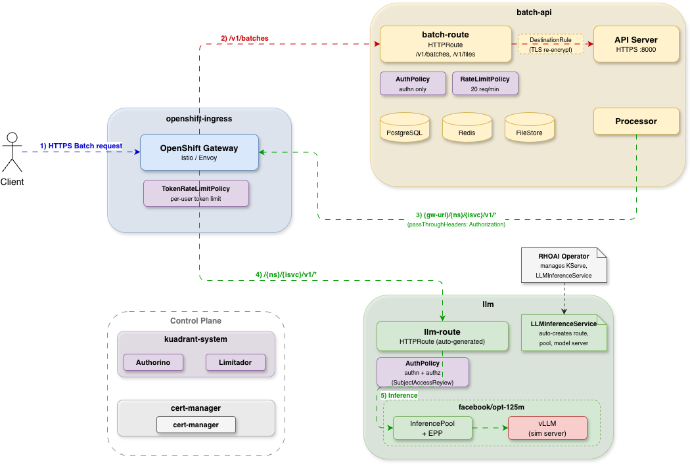

# Batch Gateway on Red Hat OpenShift AI (RHOAI)

This guide demonstrates how to deploy batch-gateway on OpenShift with RHOAI (Red Hat OpenShift AI), using Red Hat Connectivity Link (Kuadrant) for authentication, authorization, and rate limiting.

## 1. Architecture

### 1.1 Namespace Layout

| Namespace | Purpose |
|-----------|---------|
| `openshift-ingress` | Gateway data plane (Istio/Envoy proxy), managed by Ingress Operator |
| `cert-manager-operator` | cert-manager operator subscription |
| `cert-manager` | cert-manager controller, webhook, cainjector |
| `openshift-lws-operator` | LeaderWorkerSet operator (required by LLMInferenceService) |
| `kuadrant-system` | Kuadrant operator, Authorino, Limitador |
| `redhat-ods-operator` | RHOAI operator |
| `redhat-ods-applications` | RHOAI controllers (KServe, model controller) |
| `batch-api` | batch-gateway (apiserver + processor), Redis, PostgreSQL |
| `llm` | LLMInferenceService, model servers, InferencePool, EPP |

### 1.2 Data Flow




**Batch inference flow**:
1. Client sends a batch request (e.g. `POST /v1/batches`) to the OpenShift Gateway (`openshift-ai-inference`) with a Kubernetes token
2. Gateway matches `/v1/batches`, `/v1/files` → **batch-route** (HTTPRoute)
    - **AuthPolicy** on the batch-route performs authentication only (kubernetesTokenReview, no authorization check) — unauthenticated requests are rejected with 401
    - **RateLimitPolicy** on the batch-route enforces per-user request rate limiting (e.g. 20 req/min), keyed by Kubernetes username (user or ServiceAccount) from TokenReview — excess requests are rejected with 429
    - Authenticated request is forwarded to **batch-gateway apiserver**, which stores the batch job
3. **Processor** dequeues the batch job and sends inference requests back through the same OpenShift Gateway (`openshift-ai-inference`) with the user's original token
4. The Gateway matches `/{ns}/{isvc}/v1/*` → **llm-route** (HTTPRoute, auto-generated by LLMInferenceService)
    - **AuthPolicy** on the llm-route performs authentication and authorization (SubjectAccessReview — checks if the original user can `get llminferenceservices/<name>`) — if the user lacks permission, the request is rejected with 403
    - **TokenRateLimitPolicy** on the Gateway enforces per-user token rate limiting, keyed by Kubernetes username from TokenReview
5. Request is routed to **InferencePool** → **EPP** (endpoint picker) → **vLLM** model server, and the response is returned to the Processor, which adds the response to the batch job's output file

### 1.3 Authentication

Both the LLM route and the batch route use **kubernetesTokenReview** for authentication. Clients must provide a valid Kubernetes token via the `Authorization: Bearer <token>` header. The token must include the audience `https://kubernetes.default.svc`.

```bash
# Create a token for a ServiceAccount
oc create token <sa-name> -n <namespace> --audience=https://kubernetes.default.svc --duration=10m
```

HTTPRoute authentication behavior:
- **LLM route**: Requires a valid Kubernetes token — unauthenticated requests are rejected with **401**
- **Batch route**: Requires a valid Kubernetes token — unauthenticated requests are rejected with **401**

### 1.4 Authorization Model

Users need RBAC `get` permission on the specific `LLMInferenceService` resource to access the model. To grant access, create a Role and RoleBinding:

```bash
oc apply -f - <<EOF
apiVersion: rbac.authorization.k8s.io/v1
kind: Role
metadata:
  name: llm-reader
  namespace: <llm-namespace>
rules:
- apiGroups: ["serving.kserve.io"]
  resources: ["llminferenceservices"]
  resourceNames: ["<isvc-name>"]
  verbs: ["get"]
---
apiVersion: rbac.authorization.k8s.io/v1
kind: RoleBinding
metadata:
  name: llm-reader-binding
  namespace: <llm-namespace>
subjects:
- kind: ServiceAccount
  name: <sa-name>
  namespace: <llm-namespace>
roleRef:
  kind: Role
  name: llm-reader
  apiGroup: rbac.authorization.k8s.io
EOF
```

Verify that the user has access:

```bash
oc auth can-i get llminferenceservices/<isvc-name> -n <llm-namespace> --as=system:serviceaccount:<namespace>:<sa-name>
# Expected output: yes
```

HTTPRoute authorization behavior:
- **LLM route**: SubjectAccessReview checks if user can `get llminferenceservices/<name>` — unauthorized requests are rejected with **403**
- **Batch route**: No authorization check — authorization is enforced by the LLM route when the processor forwards inference requests with the user's original token

### 1.5 Security boundary: batch-route vs llm-route

For security and operations readers: **admission on the batch API is not the same as authorization for inference.**

- **batch-route** proves the caller has a valid Kubernetes token and applies batch-side **RateLimitPolicy**. Invalid or missing credentials are rejected with **401**; excess batch API traffic is rejected with **429**. It does **not** evaluate whether the caller may use a specific `LLMInferenceService`.
- **llm-route** runs **authentication and authorization** (SubjectAccessReview on `llminferenceservices` as above) on each inference request the processor sends through the gateway. A user can create a batch job and still see **per-request failures** (often surfaced as failed lines or job errors) when the llm-route returns **403** — this is **by design**, not a bypass of model access control.

Configure **`passThroughHeaders: {Authorization}`** so the processor forwards the end user’s bearer token on inference calls. Without that, the gateway cannot attribute inference traffic to the original caller and model-level checks cannot run as intended.

## 2. Prerequisites
- OpenShift cluster 4.20 or later (required for Distributed Inference with llm-d).
- Red Hat OpenShift AI 3.4 or later.
- OpenShift Service Mesh v2 is not installed in the cluster.


## 3. Installation Steps


### 3.1 Install cert-manager

Install the OpenShift cert-manager operator (required by LeaderWorkerSet and batch-gateway TLS). See the [cert-manager Operator for Red Hat OpenShift documentation](https://docs.redhat.com/en/documentation/openshift_container_platform/4.21/html/security_and_compliance/cert-manager-operator-for-red-hat-openshift).

<details>
<summary>Install cert-manager operator</summary>

```bash
oc apply -f - <<'EOF'
apiVersion: v1
kind: Namespace
metadata:
  name: cert-manager-operator
---
apiVersion: operators.coreos.com/v1
kind: OperatorGroup
metadata:
  name: cert-manager-operator
  namespace: cert-manager-operator
---
apiVersion: operators.coreos.com/v1alpha1
kind: Subscription
metadata:
  name: openshift-cert-manager-operator
  namespace: cert-manager-operator
spec:
  channel: stable-v1
  installPlanApproval: Automatic
  name: openshift-cert-manager-operator
  source: redhat-operators
  sourceNamespace: openshift-marketplace
EOF

# Wait for cert-manager webhook to be ready (this implies the operator CSV succeeded)
until oc get deployment cert-manager-webhook -n cert-manager &>/dev/null; do sleep 10; done
oc rollout status deployment/cert-manager-webhook -n cert-manager --timeout=300s
```

</details>

<details>
<summary>Create a self-signed ClusterIssuer</summary>

```bash
# Wait for the cert-manager webhook TLS to be fully bootstrapped (~15s after rollout)
sleep 15

# Create a self-signed ClusterIssuer (used later by batch-gateway for TLS)
oc apply -f - <<EOF
apiVersion: cert-manager.io/v1
kind: ClusterIssuer
metadata:
  name: selfsigned-issuer
spec:
  selfSigned: {}
EOF
```

</details>

### 3.2 Install LeaderWorkerSet operator

LLMInferenceService requires the LeaderWorkerSet (LWS) CRD. Install the LWS operator. See the [Leader Worker Set Operator documentation](https://docs.redhat.com/en/documentation/openshift_container_platform/4.21/html/ai_workloads/leader-worker-set-operator).

<details>
<summary>Install LWS operator</summary>

```bash
oc apply -f - <<'EOF'
apiVersion: v1
kind: Namespace
metadata:
  name: openshift-lws-operator
---
apiVersion: operators.coreos.com/v1
kind: OperatorGroup
metadata:
  name: leader-worker-set
  namespace: openshift-lws-operator
spec:
  targetNamespaces:
  - openshift-lws-operator
---
apiVersion: operators.coreos.com/v1alpha1
kind: Subscription
metadata:
  name: leader-worker-set
  namespace: openshift-lws-operator
spec:
  channel: stable-v1.0
  installPlanApproval: Automatic
  name: leader-worker-set
  source: redhat-operators
  sourceNamespace: openshift-marketplace
EOF

# Wait for the operator deployment to be ready
until oc get deployment openshift-lws-operator -n openshift-lws-operator &>/dev/null; do sleep 10; done
oc rollout status deployment/openshift-lws-operator -n openshift-lws-operator --timeout=300s

# Create the LeaderWorkerSetOperator CR
oc apply -f - <<'EOF'
apiVersion: operator.openshift.io/v1
kind: LeaderWorkerSetOperator
metadata:
  name: cluster
  namespace: openshift-lws-operator
spec:
  managementState: Managed
EOF

# Wait for the LWS CRD to be available (may take ~30s for the controller to deploy)
until oc get crd leaderworkersets.leaderworkerset.x-k8s.io &>/dev/null; do sleep 5; done
oc wait crd/leaderworkersets.leaderworkerset.x-k8s.io --for=condition=Established --timeout=120s
```

</details>

### 3.3 Create OpenShift GatewayClass and Gateway

Create a GatewayClass and a Gateway named `openshift-ai-inference` in the `openshift-ingress` namespace as described in [Gateway API with OpenShift Container Platform Networking](https://docs.redhat.com/en/documentation/openshift_container_platform/4.21/html/ingress_and_load_balancing/configuring-ingress-cluster-traffic#ingress-gateway-api).

<details>
<summary>Create GatewayClass</summary>

Create the GatewayClass — this triggers the Ingress Operator to install a lightweight Service Mesh (Istio) automatically.
```bash
oc apply -f - <<'EOF'
apiVersion: gateway.networking.k8s.io/v1
kind: GatewayClass
metadata:
  name: openshift-default
spec:
  controllerName: openshift.io/gateway-controller/v1
EOF

# Wait for the Istiod deployment to appear and become ready (~20s)
until oc get deployment istiod-openshift-gateway -n openshift-ingress &>/dev/null; do sleep 5; done
oc rollout status deployment/istiod-openshift-gateway -n openshift-ingress --timeout=120s
```
</details>


<details>
<summary>Create the Gateway with a hostname matching your cluster domain</summary>

```bash
DOMAIN=$(oc get ingresses.config/cluster -o jsonpath='{.spec.domain}')
HOSTNAME="llm-inference.${DOMAIN}"

oc apply -f - <<EOF
apiVersion: gateway.networking.k8s.io/v1
kind: Gateway
metadata:
  name: openshift-ai-inference
  namespace: openshift-ingress
spec:
  gatewayClassName: openshift-default
  listeners:
  - name: http
    hostname: "${HOSTNAME}"
    port: 80
    protocol: HTTP
    allowedRoutes:
      namespaces:
        from: All
  - name: https
    hostname: "${HOSTNAME}"
    port: 443
    protocol: HTTPS
    tls:
      mode: Terminate
      certificateRefs:
      - name: router-certs-default
    allowedRoutes:
      namespaces:
        from: All
EOF

# Wait for the Envoy proxy deployment to become ready
until oc get deployment openshift-ai-inference-openshift-default -n openshift-ingress &>/dev/null; do sleep 5; done
oc rollout status deployment/openshift-ai-inference-openshift-default -n openshift-ingress --timeout=120s
```

> **Note**: The Gateway uses the OpenShift default router certificate (`router-certs-default`). The hostname must match the cluster's wildcard DNS for external access.

</details>

### 3.4 Install RHCL

Follow [Red Hat Connectivity Link docs](https://docs.redhat.com/en/documentation/red_hat_connectivity_link/1.3) to install RHCL

<details>
<summary>Install RHCL operator</summary>

```bash
KUADRANT_NS=kuadrant-system
oc create namespace "${KUADRANT_NS}" 2>/dev/null || true

oc apply -f - <<EOF
apiVersion: operators.coreos.com/v1alpha1
kind: Subscription
metadata:
  name: rhcl-operator
  namespace: ${KUADRANT_NS}
spec:
  channel: stable
  installPlanApproval: Automatic
  name: rhcl-operator
  source: redhat-operators
  sourceNamespace: openshift-marketplace
---
apiVersion: operators.coreos.com/v1
kind: OperatorGroup
metadata:
  name: kuadrant
  namespace: ${KUADRANT_NS}
spec:
  upgradeStrategy: Default
EOF
```

</details>

<details>
<summary>Create Kuadrant CR</summary>

Wait for the operator to be ready, then create the Kuadrant CR:

```bash
# Wait for RHCL operator to be ready
until oc get csv -n "${KUADRANT_NS}" 2>/dev/null | grep rhcl-operator | grep -q Succeeded; do sleep 10; done

oc apply -f - <<EOF
apiVersion: kuadrant.io/v1beta1
kind: Kuadrant
metadata:
  name: kuadrant
  namespace: ${KUADRANT_NS}
spec: {}
EOF

# Wait for Kuadrant instance to be ready
oc wait kuadrant/kuadrant --for="condition=Ready=true" \
    -n "${KUADRANT_NS}" --timeout=300s
```

</details>

<details>
<summary>Configure Authorino TLS</summary>

Configure Authorino with OpenShift serving certificates for TLS:

```bash
oc annotate svc/authorino-authorino-authorization \
    service.beta.openshift.io/serving-cert-secret-name=authorino-server-cert \
    -n "${KUADRANT_NS}" --overwrite

oc apply -f - <<EOF
apiVersion: operator.authorino.kuadrant.io/v1beta1
kind: Authorino
metadata:
  name: authorino
  namespace: ${KUADRANT_NS}
spec:
  replicas: 1
  clusterWide: true
  listener:
    tls:
      enabled: true
      certSecretRef:
        name: authorino-server-cert
  oidcServer:
    tls:
      enabled: false
EOF

oc wait --for=condition=ready pod -l authorino-resource=authorino \
    -n "${KUADRANT_NS}" --timeout=150s
```

</details>

### 3.5 Install RHOAI

Follow [RHOAI Installation Guide](https://docs.redhat.com/en/documentation/red_hat_openshift_ai_self-managed/3.4/html/installing_and_uninstalling_openshift_ai_self-managed/index) to install RHOAI

<details>
<summary>Install RHOAI operator</summary>

```bash
oc create namespace redhat-ods-operator 2>/dev/null || true

oc apply -f - <<'EOF'
apiVersion: operators.coreos.com/v1
kind: OperatorGroup
metadata:
  name: rhods-operator
  namespace: redhat-ods-operator
spec: {}
---
apiVersion: operators.coreos.com/v1alpha1
kind: Subscription
metadata:
  name: rhods-operator
  namespace: redhat-ods-operator
spec:
  channel: fast-3.x
  installPlanApproval: Automatic
  name: rhods-operator
  source: redhat-operators
  sourceNamespace: openshift-marketplace
EOF
```

</details>

<details>
<summary>Create DataScienceCluster instance</summary>

Wait for the RHOAI operator CSV to succeed, then create DataScienceCluster:

```bash
# Wait for the RHOAI operator CSV and DataScienceCluster CRD to be ready
until oc get csv -n redhat-ods-operator 2>/dev/null | grep -q Succeeded; do sleep 10; done
until oc get crd datascienceclusters.datasciencecluster.opendatahub.io &>/dev/null; do sleep 5; done

# Wait for the RHOAI operator webhook to be ready
until oc get deployment rhods-operator -n redhat-ods-operator &>/dev/null; do sleep 10; done
oc rollout status deployment/rhods-operator -n redhat-ods-operator --timeout=120s
```

```bash
oc apply -f - <<'EOF'
apiVersion: datasciencecluster.opendatahub.io/v2
kind: DataScienceCluster
metadata:
  name: default-dsc
spec:
  components:
    kserve:
      managementState: Managed
      rawDeploymentServiceConfig: Headed
      modelsAsService:
        managementState: Removed
    dashboard:
      managementState: Removed
EOF
```
</details>

<details>
<summary>Wait for the DataScienceCluster to be ready</summary>

```bash
oc get datasciencecluster default-dsc

oc wait datasciencecluster/default-dsc --for=jsonpath='{.status.phase}'=Ready --timeout=600s
```

> **Note**: If Connectivity Link was installed after RHOAI, restart the RHOAI controllers to pick up Authorino:
> ```bash
> oc delete pod -n redhat-ods-applications -l app=odh-model-controller
> oc delete pod -n redhat-ods-applications -l control-plane=kserve-controller-manager
> ```

</details>

### 3.6 Deploy model with llm-d

Follow [deploy model doc](https://docs.redhat.com/en/documentation/red_hat_openshift_ai_self-managed/3.4/html/deploying_models/deploying_models#deploying-models-using-distributed-inference_rhoai-user) to deploy model with LLM-D

For more examples: [kserve samples repo](https://github.com/red-hat-data-services/kserve/tree/rhoai-3.4/docs/samples/llmisvc)

The following example deploys a simulated model with `LLMInferenceService`.

<details>
<summary>Deploy a simulated model with LLMInferenceService</summary>

```bash
LLM_NS=llm
MODEL_NAME="facebook/opt-125m"
ISVC_NAME=$(echo "${MODEL_NAME}" | tr '/' '-' | tr '[:upper:]' '[:lower:]')

oc create namespace "${LLM_NS}" 2>/dev/null || true

oc apply -f - <<EOF
apiVersion: serving.kserve.io/v1alpha1
kind: LLMInferenceService
metadata:
  name: ${ISVC_NAME}
  namespace: ${LLM_NS}
  annotations:
    # Enables Gateway-level AuthPolicy (SubjectAccessReview on LLMInferenceService)
    security.opendatahub.io/enable-auth: "true"
spec:
  model:
    uri: hf://sshleifer/tiny-gpt2
    name: ${MODEL_NAME}
  replicas: 2
  router:
    route: {}
    gateway:
      refs:
        - name: openshift-ai-inference
          namespace: openshift-ingress
    scheduler: {}
  template:
    containers:
      - name: main
        image: ghcr.io/llm-d/llm-d-inference-sim:v0.7.1
        imagePullPolicy: Always
        command: ["/app/llm-d-inference-sim"]
        args:
        - --port
        - "8000"
        - --model
        - ${MODEL_NAME}
        - --mode
        - random
        - --ssl-certfile
        - /var/run/kserve/tls/tls.crt
        - --ssl-keyfile
        - /var/run/kserve/tls/tls.key
        ports:
          - name: https
            containerPort: 8000
            protocol: TCP
        resources:
          requests:
            cpu: 100m
            memory: 256Mi
          limits:
            cpu: 500m
            memory: 512Mi
EOF
```

</details>

<details>
<summary>Wait for the LLMInferenceService to be ready</summary>

Wait for the LLMInferenceService to be ready:
```bash
oc wait llminferenceservice/${ISVC_NAME} -n ${LLM_NS} \
    --for=condition=Ready --timeout=600s
```
> **Key annotation**: `security.opendatahub.io/enable-auth: "true"` enables the Gateway-level AuthPolicy that uses SubjectAccessReview to check if the user has RBAC permission to `get` the specific `LLMInferenceService` resource.
</details>

<details>
<summary>Check LLM-D deployment</summary>

> **Note**: This `LLMInferenceService` CRD automatically creates the model server Deployment, InferencePool, EPP, and HTTPRoute.

```
oc get all -n llm
NAME                                                             READY   STATUS    RESTARTS   AGE
pod/facebook-opt-125m-kserve-85958d5dc-gp6kt                     1/1     Running   0          11m
pod/facebook-opt-125m-kserve-85958d5dc-q529j                     1/1     Running   0          11m
pod/facebook-opt-125m-kserve-router-scheduler-5d76d9f8b4-mvqs4   1/1     Running   0          11m

NAME                                                   TYPE        CLUSTER-IP      EXTERNAL-IP   PORT(S)                               AGE
service/facebook-opt-125m-epp-service                  ClusterIP   172.30.85.208   <none>        9002/TCP,9003/TCP,9090/TCP,5557/TCP   11m
service/facebook-opt-125m-inference-pool-ip-cf7269e1   ClusterIP   None            <none>        54321/TCP                             11m
service/facebook-opt-125m-kserve-workload-svc          ClusterIP   172.30.3.51     <none>        8000/TCP                              11m

NAME                                                        READY   UP-TO-DATE   AVAILABLE   AGE
deployment.apps/facebook-opt-125m-kserve                    2/2     2            2           11m
deployment.apps/facebook-opt-125m-kserve-router-scheduler   1/1     1            1           11m

NAME                                                                   DESIRED   CURRENT   READY   AGE
replicaset.apps/facebook-opt-125m-kserve-85958d5dc                     2         2         2       11m
replicaset.apps/facebook-opt-125m-kserve-router-scheduler-5d76d9f8b4   1         1         1       11m

oc get httproute -n llm
NAME                             HOSTNAMES   AGE
facebook-opt-125m-kserve-route               13m
```
</details>

### 3.7 Configure TokenRateLimitPolicy for LLMInferenceService

> **Note**: The TokenRateLimitPolicy targets the Gateway (not HTTPRoute) because LLMInferenceService dynamically generates the inference HTTPRoute name.

<details>
<summary>Apply per-user token rate limiting on inference requests</summary>

```bash
oc apply -f - <<EOF
apiVersion: kuadrant.io/v1alpha1
kind: TokenRateLimitPolicy
metadata:
  name: inference-token-limit
  namespace: openshift-ingress
spec:
  targetRef:
    group: gateway.networking.k8s.io
    kind: Gateway
    name: openshift-ai-inference
  limits:
    per-user:
      rates:
      - limit: 500
        window: 1m
      when:
      - predicate: request.path.endsWith("/v1/chat/completions")
      counters:
      - expression: auth.identity.user.username
EOF

# wait for policy to be enforced
oc wait tokenratelimitpolicy/inference-token-limit \
    --for="condition=Enforced=true" \
    -n openshift-ingress --timeout=120s
```
</details>


### 3.8 Install Batch Gateway

Deploy batch-gateway with the model gateway URL from the LLMInferenceService status:

<details>
<summary>Create namespace and install dependencies</summary>

```bash
BATCH_NS=batch-api
oc create namespace "${BATCH_NS}" 2>/dev/null || true

# Install Redis
helm install redis oci://registry-1.docker.io/bitnamicharts/redis \
    --namespace ${BATCH_NS} --create-namespace \
    --set architecture=standalone \
    --set auth.enabled=false
oc rollout status statefulset/redis-master -n ${BATCH_NS} --timeout=120s

# Install PostgreSQL
helm install postgresql oci://registry-1.docker.io/bitnamicharts/postgresql \
    --namespace ${BATCH_NS} --create-namespace \
    --set auth.postgresPassword=postgres \
    --set auth.database=batch
oc rollout status statefulset/postgresql -n ${BATCH_NS} --timeout=120s

# Create application secret
# Replace <your-password> with your actual PostgreSQL password
kubectl create secret generic batch-gateway-secrets \
    --namespace ${BATCH_NS} \
    --from-literal=redis-url="redis://redis-master.${BATCH_NS}.svc.cluster.local:6379/0" \
    --from-literal=postgresql-url="postgresql://postgres:<your-password>@postgresql.${BATCH_NS}.svc.cluster.local:5432/batch?sslmode=disable"

# Create PVC for batch file storage (alternatively, S3-compatible storage can be used — see Helm chart values for s3 configuration)
oc apply -f - <<EOF
apiVersion: v1
kind: PersistentVolumeClaim
metadata:
  name: batch-gateway-files
  namespace: ${BATCH_NS}
spec:
  accessModes: [ReadWriteMany]
  resources:
    requests:
      storage: 1Gi
EOF
```

> **Note**: Redis auth and PostgreSQL persistence are disabled for demo purposes. For production, enable Redis authentication and configure persistent storage.

</details>

<details>
<summary>Install batch-gateway</summary>

```bash
IMAGE_TAG=v0.1.0
APISERVER_REPO=quay.io/redhat-user-workloads/open-data-hub-tenant/temp-batch-gateway-apiserver
PROCESSOR_REPO=quay.io/redhat-user-workloads/open-data-hub-tenant/temp-batch-gateway-processor
GC_REPO=quay.io/redhat-user-workloads/open-data-hub-tenant/temp-batch-gateway-gc
```

```bash
# Get model URL from LLMInferenceService
MODEL_URL=$(oc get llminferenceservice ${ISVC_NAME} -n ${LLM_NS} \
    -o jsonpath='{.status.url}')

# Install batch-gateway
helm install batch-gateway ./charts/batch-gateway \
    --namespace ${BATCH_NS} \
    --set "apiserver.image.repository=${APISERVER_REPO}" \
    --set "apiserver.image.tag=${IMAGE_TAG}" \
    --set "processor.image.repository=${PROCESSOR_REPO}" \
    --set "processor.image.tag=${IMAGE_TAG}" \
    --set "gc.image.repository=${GC_REPO}" \
    --set "gc.image.tag=${IMAGE_TAG}" \
    --set "global.secretName=batch-gateway-secrets" \
    --set "global.dbClient.type=postgresql" \
    --set "global.fileClient.type=fs" \
    --set "global.fileClient.fs.basePath=/tmp/batch-gateway" \
    --set "global.fileClient.fs.pvcName=batch-gateway-files" \
    --set "processor.config.modelGateways.facebook/opt-125m.url=${MODEL_URL}" \
    --set "processor.config.modelGateways.facebook/opt-125m.requestTimeout=5m" \
    --set "processor.config.modelGateways.facebook/opt-125m.maxRetries=3" \
    --set "processor.config.modelGateways.facebook/opt-125m.initialBackoff=1s" \
    --set "processor.config.modelGateways.facebook/opt-125m.maxBackoff=60s" \
    --set "processor.config.modelGateways.facebook/opt-125m.tlsInsecureSkipVerify=true" \
    --set "apiserver.config.batchAPI.passThroughHeaders={Authorization}" \
    --set apiserver.tls.enabled=true \
    --set apiserver.tls.certManager.enabled=true \
    --set apiserver.tls.certManager.issuerName=selfsigned-issuer \
    --set apiserver.tls.certManager.issuerKind=ClusterIssuer \
    --set "apiserver.tls.certManager.dnsNames={batch-gateway-apiserver,batch-gateway-apiserver.${BATCH_NS}.svc.cluster.local,localhost}" \
```

> - **`modelGateways.<model>.url`**: The processor uses this URL to send inference requests. It should point to the Gateway's model endpoint (from `llminferenceservice.status.url`), not directly to the model server, so that requests go through the Gateway's AuthPolicy and rate limiting.
> - **`passThroughHeaders: {Authorization}`**: Ensures the processor sends inference requests on behalf of the original user, so the LLM route's AuthPolicy can enforce model-level authorization on batch requests.
>
> - **`apiserver.tls.certManager.*`**: Enables TLS for the batch API server using cert-manager. The `issuerName` must match a ClusterIssuer (e.g. `selfsigned-issuer`). The `dnsNames` should include the Service name and FQDN so the Gateway can verify the backend certificate when re-encrypting traffic (see DestinationRule in 3.9).
> - **File storage**: This example uses `global.fileClient.type=fs` with a PVC. To use S3-compatible storage instead, replace the `fs` options with:
>   ```
>   --set "global.fileClient.type=s3"
>   --set "global.fileClient.s3.endpoint=http://<s3-endpoint>:9000"
>   --set "global.fileClient.s3.region=us-east-1"
>   --set "global.fileClient.s3.accessKeyId=<access-key>"
>   --set "global.fileClient.s3.prefix=<bucket-name>"
>   --set "global.fileClient.s3.usePathStyle=true"
>   --set "global.fileClient.s3.autoCreateBucket=true"
>   ```
>   and add `--from-literal=s3-secret-access-key=<secret-key>` to the application secret.

</details>


### 3.9 Configure HTTPRoute and Policies for Batch Gateway

Create the batch route, authentication policy, and rate limit:

<details>
<summary>Create HTTPRoute for Batch API Server</summary>

```bash
# Batch HTTPRoute
oc apply -f - <<EOF
apiVersion: gateway.networking.k8s.io/v1
kind: HTTPRoute
metadata:
  name: batch-route
  namespace: ${BATCH_NS}
spec:
  parentRefs:
  - name: openshift-ai-inference
    namespace: openshift-ingress
  rules:
  - matches:
    - path:
        type: PathPrefix
        value: /v1/batches
    - path:
        type: PathPrefix
        value: /v1/files
    backendRefs:
    - name: batch-gateway-apiserver
      port: 8000
EOF

# DestinationRule for TLS re-encrypt between Gateway and batch apiserver)
oc apply -f - <<EOF
apiVersion: networking.istio.io/v1
kind: DestinationRule
metadata:
  name: batch-gateway-backend-tls
  namespace: openshift-ingress
spec:
  host: batch-gateway-apiserver.${BATCH_NS}.svc.cluster.local
  trafficPolicy:
    portLevelSettings:
    - port:
        number: 8000
      tls:
        mode: SIMPLE
        insecureSkipVerify: true
EOF
```

</details>


<details>
<summary>Create AuthPolicy for Batch API Server</summary>

```bash
# Batch AuthPolicy (authentication only, no authorization)
oc apply -f - <<EOF
apiVersion: kuadrant.io/v1
kind: AuthPolicy
metadata:
  name: batch-route-auth
  namespace: ${BATCH_NS}
spec:
  targetRef:
    group: gateway.networking.k8s.io
    kind: HTTPRoute
    name: batch-route
  rules:
    authentication:
      kubernetes-user:
        kubernetesTokenReview:
          audiences:
          - https://kubernetes.default.svc
EOF

```

</details>

<details>
<summary>Create RateLimitPolicy for Batch API Server</summary>

```bash
# Batch RateLimitPolicy (20 requests/min per user)
oc apply -f - <<EOF
apiVersion: kuadrant.io/v1
kind: RateLimitPolicy
metadata:
  name: batch-ratelimit
  namespace: ${BATCH_NS}
spec:
  targetRef:
    group: gateway.networking.k8s.io
    kind: HTTPRoute
    name: batch-route
  limits:
    per-user:
      rates:
      - limit: 20
        window: 1m
      counters:
      - expression: auth.identity.user.username
EOF
```

</details>

## 4. Test

### 4.1 Setup Test Accounts
```bash
# Get Gateway hostname (OpenShift router uses SNI-based routing, so the
# spec hostname is required — the raw LB address won't work)
GW_HOSTNAME=$(oc get gateway openshift-ai-inference -n openshift-ingress \
    -o jsonpath='{.spec.listeners[0].hostname}')
GW_URL="https://${GW_HOSTNAME}"

ISVC_NAME=$(echo "${MODEL_NAME}" | tr '/' '-' | tr '[:upper:]' '[:lower:]')

# Create authorized SA with RBAC to access the LLMInferenceService
oc create serviceaccount test-authorized-sa -n ${LLM_NS}
oc apply -f - <<EOF
apiVersion: rbac.authorization.k8s.io/v1
kind: Role
metadata:
  name: test-authorized-sa-llm-reader
  namespace: ${LLM_NS}
rules:
- apiGroups: ["serving.kserve.io"]
  resources: ["llminferenceservices"]
  resourceNames: ["${ISVC_NAME}"]
  verbs: ["get"]
---
apiVersion: rbac.authorization.k8s.io/v1
kind: RoleBinding
metadata:
  name: test-authorized-sa-llm-reader
  namespace: ${LLM_NS}
subjects:
- kind: ServiceAccount
  name: test-authorized-sa
  namespace: ${LLM_NS}
roleRef:
  kind: Role
  name: test-authorized-sa-llm-reader
  apiGroup: rbac.authorization.k8s.io
EOF

AUTH_TOKEN=$(oc create token test-authorized-sa -n ${LLM_NS} \
    --audience=https://kubernetes.default.svc --duration=10m)

# Create unauthorized SA (no RBAC)
oc create serviceaccount test-unauthorized-sa -n ${LLM_NS}
UNAUTH_TOKEN=$(oc create token test-unauthorized-sa -n ${LLM_NS} \
    --audience=https://kubernetes.default.svc --duration=10m)
```

### 4.2 LLM Authentication

```bash
# Unauthenticated -> 401
curl -sk -o /dev/null -w "%{http_code}" \
    ${GW_URL}/${LLM_NS}/${ISVC_NAME}/v1/chat/completions \
    -H 'Content-Type: application/json' \
    -d '{"model":"'${MODEL_NAME}'","messages":[{"role":"user","content":"Hello"}],"max_tokens":10}'

# Authenticated -> 200
curl -sk -o /dev/null -w "%{http_code}" \
    ${GW_URL}/${LLM_NS}/${ISVC_NAME}/v1/chat/completions \
    -H 'Content-Type: application/json' \
    -H "Authorization: Bearer ${AUTH_TOKEN}" \
    -d '{"model":"'${MODEL_NAME}'","messages":[{"role":"user","content":"Hello"}],"max_tokens":10}'
```

### 4.3 LLM Authorization

```bash
# Unauthorized SA -> 403
curl -sk -o /dev/null -w "%{http_code}" \
    ${GW_URL}/${LLM_NS}/${ISVC_NAME}/v1/chat/completions \
    -H 'Content-Type: application/json' \
    -H "Authorization: Bearer ${UNAUTH_TOKEN}" \
    -d '{"model":"'${MODEL_NAME}'","messages":[{"role":"user","content":"Hello"}],"max_tokens":10}'

# Authorized SA -> 200
curl -sk -o /dev/null -w "%{http_code}" \
    ${GW_URL}/${LLM_NS}/${ISVC_NAME}/v1/chat/completions \
    -H 'Content-Type: application/json' \
    -H "Authorization: Bearer ${AUTH_TOKEN}" \
    -d '{"model":"'${MODEL_NAME}'","messages":[{"role":"user","content":"Hello"}],"max_tokens":10}'
```

### 4.4 LLM Token Rate Limit

```bash
# Send requests until 429 (token rate limit)
for i in $(seq 1 100); do
    http_code=$(curl -sk -o /dev/null -w '%{http_code}' \
        ${GW_URL}/${LLM_NS}/${ISVC_NAME}/v1/chat/completions \
        -H 'Content-Type: application/json' \
        -H "Authorization: Bearer ${AUTH_TOKEN}" \
        -d '{"model":"'${MODEL_NAME}'","messages":[{"role":"user","content":"Hello"}],"max_tokens":100}')
    if [ "$http_code" = "429" ]; then
        echo "Request $i: 429 Token Rate Limited"
        break
    fi
done
# Wait 60s for rate limit counters to reset
sleep 60
```

### 4.5 Batch Authentication

```bash
# Unauthenticated -> 401
curl -sk -o /dev/null -w "%{http_code}" ${GW_URL}/v1/batches

# Authenticated -> 200
curl -sk -o /dev/null -w "%{http_code}" \
    -H "Authorization: Bearer ${AUTH_TOKEN}" ${GW_URL}/v1/batches
```

### 4.6 Batch Authorization (LLM route enforcement)

```bash
# Unauthorized user creates a batch — batch is accepted (batch route has no authz),
# but the processor forwards requests to the LLM route with the unauthorized token,
# and the LLM route's AuthPolicy rejects with 403.

# Create input file
cat > /tmp/batch-input.jsonl <<EOF
{"custom_id":"req-1","method":"POST","url":"/v1/chat/completions","body":{"model":"${MODEL_NAME}","messages":[{"role":"user","content":"Hello"}],"max_tokens":10}}
EOF

FILE_ID=$(curl -sk ${GW_URL}/v1/files \
    -H "Authorization: Bearer ${UNAUTH_TOKEN}" \
    -F purpose=batch \
    -F "file=@/tmp/batch-input.jsonl" \
    | jq -r '.id')

BATCH_ID=$(curl -sk ${GW_URL}/v1/batches \
    -H "Authorization: Bearer ${UNAUTH_TOKEN}" \
    -H 'Content-Type: application/json' \
    -d '{"input_file_id":"'${FILE_ID}'","endpoint":"/v1/chat/completions","completion_window":"24h"}' \
    | jq -r '.id')

# Wait for processing, then check status — expect failed requests with 403
sleep 30
curl -sk ${GW_URL}/v1/batches/${BATCH_ID} \
    -H "Authorization: Bearer ${UNAUTH_TOKEN}" | jq '{status, request_counts}'
```

### 4.7 Batch Lifecycle

```bash
# Upload input file (reuse /tmp/batch-input.jsonl from 4.6, or create it)
FILE_ID=$(curl -sk ${GW_URL}/v1/files \
    -H "Authorization: Bearer ${AUTH_TOKEN}" \
    -F purpose=batch \
    -F "file=@/tmp/batch-input.jsonl" \
    | jq -r '.id')

# Create batch
BATCH_ID=$(curl -sk ${GW_URL}/v1/batches \
    -H "Authorization: Bearer ${AUTH_TOKEN}" \
    -H 'Content-Type: application/json' \
    -d '{"input_file_id":"'${FILE_ID}'","endpoint":"/v1/chat/completions","completion_window":"24h"}' \
    | jq -r '.id')

# Wait for processing, then check status
sleep 30
curl -sk ${GW_URL}/v1/batches/${BATCH_ID} \
    -H "Authorization: Bearer ${AUTH_TOKEN}" | jq '.status'

# Download results (after status is "completed")
OUTPUT_FILE_ID=$(curl -sk ${GW_URL}/v1/batches/${BATCH_ID} \
    -H "Authorization: Bearer ${AUTH_TOKEN}" | jq -r '.output_file_id')

curl -sk ${GW_URL}/v1/files/${OUTPUT_FILE_ID}/content \
    -H "Authorization: Bearer ${AUTH_TOKEN}"
```

### 4.8 Batch Request Rate Limit

```bash
# Send 25 rapid requests — expect 429 after 20 (rate limit: 20 req/min)
for i in $(seq 1 25); do
    http_code=$(curl -sk -o /dev/null -w '%{http_code}' \
        -H "Authorization: Bearer ${AUTH_TOKEN}" ${GW_URL}/v1/batches)
    echo "Request $i: $http_code"
done
```
